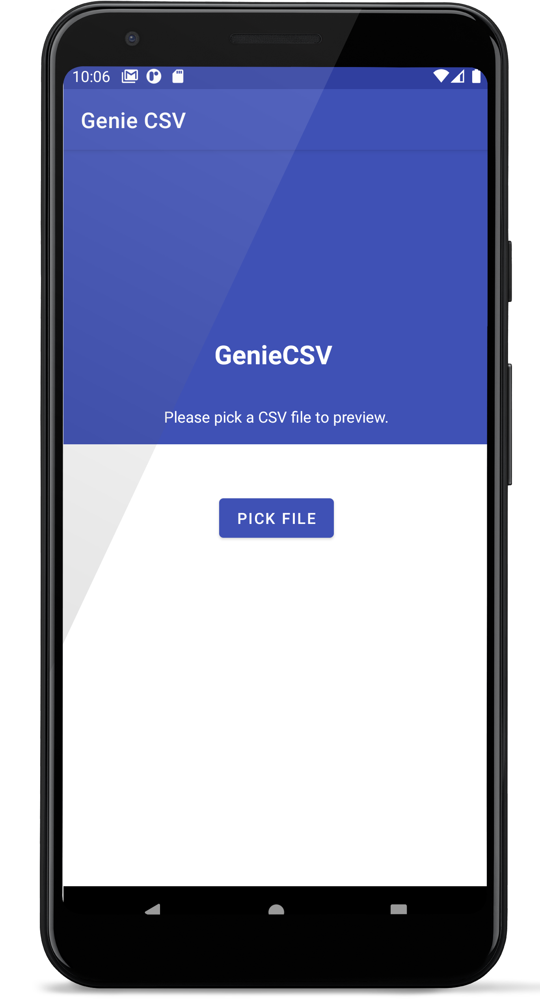

# Welcome to Genie CSV!

A simple CSV Reader app made using MVVM, Repository Pattern, Hilt and Navigation Component.

## Index

- [Key Features](#key-features)
- [Architecture](#architecture)
- [Testing Strategy](#testing-strategy)
- [Screenshots](#screenshots)
- [Libraries](#libraries)
- [Future Enhancements](#future-enhancements)
- [Known Bugs](#known-bugs)

## Key Features
 **Number of fields:** The app can read any CSV with arbitrary number of fields per row.
 
**Comma values:** Fields can contain commas if they are surrounded in quotes. 
*(Note: if ending quote doesn't exit, the remaining text in the row is considered one cell.)*

 
**Quote values:** Quotes can be added by writing them 2 times. 
*"" will become"*

**Configurable Options:** Following can be configured in the code:
1. Separator character
2. Quote character
3. Line break character
4. Skip empty rows
5. Skip missmatching rows (different number of cells than header row)
6. Remove trailing spaces

**Recycling UI:** Cells in the table UI are recycled just like RecyclerView. This means larger files will not take up large amount of RAM by creating and holding views in memory. 

## Architecture

The parser is separated out in a separate pure Kotlin module. This allows it to be reused in any platform. It can later on be published as a library itself.

## Screenshots

  

## Libraries

- **AndroidX** - ViewModel, LiveData
- **KotlinX** - Coroutines
- **Hilt** -  Dependency Injection
- **Navigation Component** - User navigation

## Future Enhancements

1. UI for changing the parser configurations.

## Known Bugs
1. **Huwaei Android 8:**  File Picker on this device didn't recognize csv files. Needs to be investigated.

